# Accelerometer-Based Motor Anomaly Detection System

가속도 센서 기반 모터 이상 탐지 시스템의 아키텍처 설계 문서.

---

## Core Components

| Component | Role |
|---|---|
| **Accelerometer** | 3축 진동 데이터 수집 (sampling rate ≥ 10kHz) |
| **EdgeProcessor** | 신호 전처리(FFT, 포락선 분석) 및 특징 추출(RMS, kurtosis, crest factor) |
| **LocalDB** | 전송 실패 시 feature vector 임시 버퍼링 (SQLite) |
| **NetworkGateway** | EdgeProcessor ↔ DiagnosisServer 간 전송 제어 |
| **DiagnosisServer** | 이상 탐지 모델 추론 및 진단 결과 생성 |
| **AlertDispatcher** | 심각도 분류 후 알림 발송 (운영자 통보) |

---

## Data & Control Flow

```
Accelerometer → EdgeProcessor → NetworkGateway → DiagnosisServer → AlertDispatcher
                     ↕
                  LocalDB
              (fail-safe buffer)
```

**정상 경로**: Accelerometer가 수집한 raw 진동 데이터를 EdgeProcessor가 전처리·특징 추출한 뒤, NetworkGateway를 통해 DiagnosisServer로 전송한다. 이상이 감지되면 AlertDispatcher가 심각도를 분류하여 알림을 발송한다.

**Fail-safe 경로**: NetworkGateway의 전송이 실패하면, EdgeProcessor는 feature vector를 LocalDB에 즉시 버퍼링한다. 이후 exponential backoff 방식으로 재전송을 시도하며, 성공 시 해당 레코드를 삭제한다.

---

## Sequence Diagram

다이어그램 소스: [`MOTOR_DIAGNOSIS.mmd`](./MOTOR_DIAGNOSIS.mmd)

```mermaid
sequenceDiagram
    participant S as Accelerometer
    participant E as EdgeProcessor
    participant DB as LocalDB
    participant N as NetworkGateway
    participant C as DiagnosisServer
    participant A as AlertDispatcher

    S->>E: raw vibration data (3-axis)
    activate E
    E->>E: signal preprocessing<br/>(FFT, envelope analysis)
    E->>E: feature extraction<br/>(RMS, kurtosis, crest factor)
    deactivate E

    E->>N: feature vector
    activate N

    alt Transmission Success
        N->>C: feature vector
        C->>C: anomaly detection<br/>(model inference)
        alt Anomaly Detected
            C->>A: diagnosis result
            A->>A: severity classification
            A-->>C: dispatch confirmed
        end
        C-->>N: ACK
        N-->>E: delivery confirmed

    else Transmission Failure
        rect rgb(80, 20, 20)
            Note over N,DB: FAIL-SAFE ACTIVATED
            N-->>E: delivery failed
            E->>DB: buffer feature vector
            DB-->>E: stored (queued)

            loop Retry Cycle (exponential backoff)
                DB->>N: dequeue buffered data
                N->>C: retry transmission
                alt Retry Success
                    C-->>N: ACK
                    N-->>DB: purge confirmed
                    DB->>DB: delete transmitted record
                else Retry Failure
                    C-->>N: NACK / timeout
                    N-->>DB: retain in queue
                end
            end
        end
    end

    deactivate N
```



---

## Fail-safe Design

전송 실패 시 데이터 유실을 방지하기 위한 핵심 설계 원칙:

1. **즉시 버퍼링** — 전송 실패 감지 즉시 LocalDB에 feature vector를 저장한다. 센서 데이터는 버려지지 않는다.
2. **Exponential Backoff 재전송** — 네트워크 복구를 기다리며 재전송 간격을 점진적으로 늘린다. 불필요한 트래픽을 방지한다.
3. **성공 시 즉시 퍼지** — 재전송 ACK 수신 후 해당 레코드를 LocalDB에서 삭제하여 저장 공간을 확보한다.
4. **큐 순서 보장** — FIFO 기반으로 버퍼링된 데이터의 시간 순서를 유지하여 진단 정확도를 보장한다.
